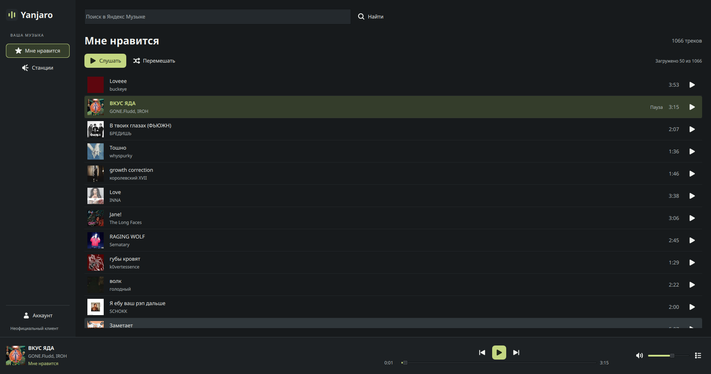
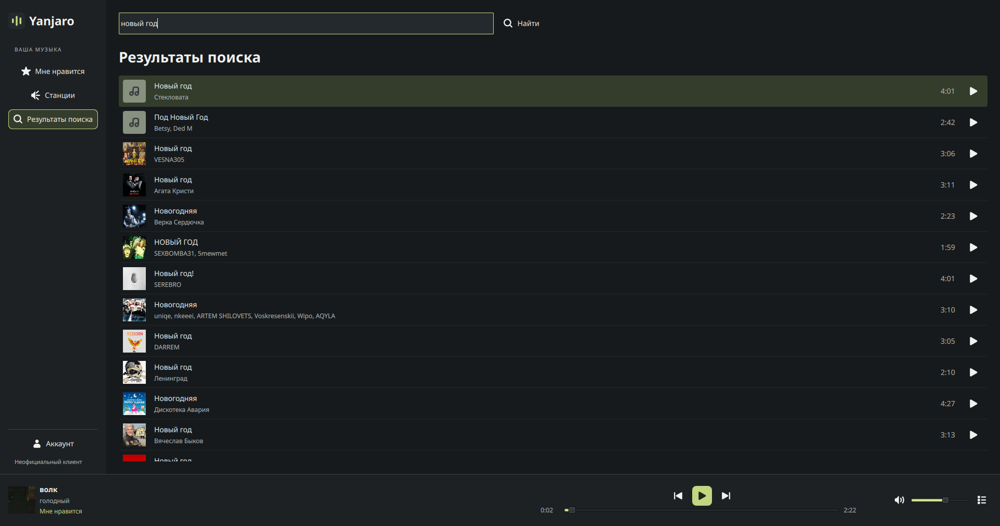
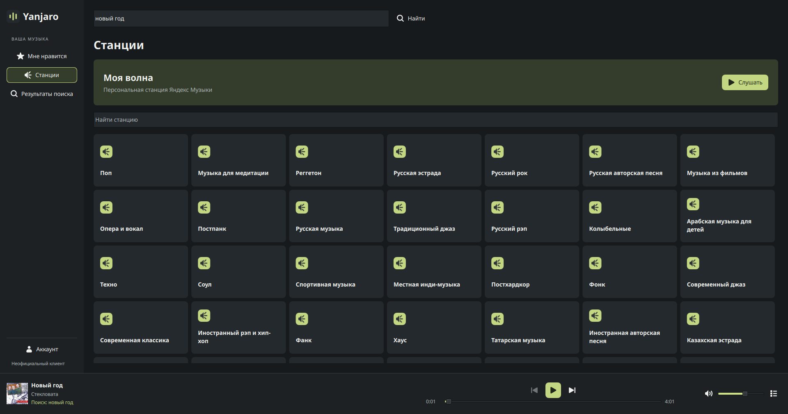
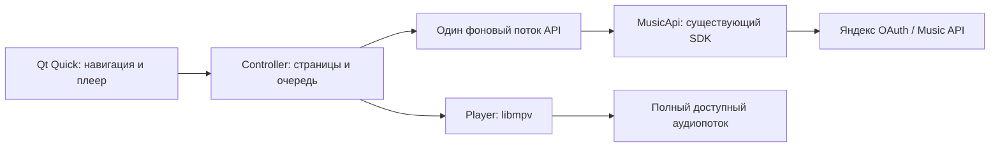

# Yanjaro Music

Неофициальный клиент **Yandex Music / Яндекс Музыки** для Manjaro. Python, PySide6 / Qt Quick и libmpv; существующая интеграция с API сохранена.

**0.2.0rc1 — локальный кандидат, не готовый публичный выпуск.** Новый интерфейс проверен автоматически; пользователь подтвердил установку пакета `-2` и основные действия с реальным аккаунтом. Обновление до `-3` подтверждено; оно исправляет чистоту сборки без изменения кода воспроизведения. Продолжение «Моей волны» подтверждено реальным запуском треков из трёх API-партий. Проверки отказов и оставшиеся ограничения указаны отдельно. Создан приватный [репозиторий zinverno/yanjaro](https://github.com/zinverno/yanjaro), работа ведётся в `feature/desktop-ui-and-packaging`. Владелец выбрал GPL-3.0-or-later. До публичного выпуска нужны общедоступный неизменяемый URL исходников и проверка в чистых Manjaro Stable и Arch. [Матрица проверок](VALIDATION.md) · [Установка и выпуск](docs/RELEASE.md) · [Статус лицензии](LICENSE-STATUS.md).







Настоящие экраны установленного пакета `0.2.0rc1-2`, Manjaro, 2026-10-07. Снимки сделаны явным `--capture-ui` во время проверки пользователя; данные аккаунта не подменялись. Выделение строки и плеер показывают выбранный трек. Помеченные синтетические снимки используются только для автоматических тестов компоновки.

## Что работает в интерфейсе

- Постоянная навигация «Мне нравится» / «Станции», глобальный поиск и меню аккаунта внизу. Результаты поиска остаются доступными после перехода на другой экран.
- Компактные виртуализированные списки с асинхронными обложками, доступностью, длительностью и явной отметкой текущего трека. Один щелчок выбирает строку, двойной или кнопка воспроизведения запускает её; Enter запускает выбранную строку.
- «Слушать» и «Перемешать» используют **полный список ID** любимых треков из API, независимо от числа загруженных строк. Метаданные ближайшей очереди загружаются отдельно. Известные недоступные треки пропускаются; если недоступность обнаружилась при запуске, есть ошибка и переход к следующему.
- Очередь отделена от навигации. Для поиска она начинается с загруженных результатов и дополняется при подгрузке того же поиска; новый поиск не меняет уже созданную очередь. Предыдущий/следующий, выбор в очереди, пауза, перемотка, громкость и mute доступны в постоянном плеере.
- Каталог станций представлен карточками; фильтр «Найти станцию» действует только внутри каталога. «Моя волна» выделена отдельно. Продолжение запрашивается автоматически при двух оставшихся треках; устаревший ответ другой станции не может заменить очередь. После ошибки автоматические попытки прекращаются до «Повторить».
- `Ctrl+F` / `Ctrl+L` переводят фокус в поиск. Пробел управляет плеером вне текстовых полей и кнопок. Стрелки на шкале перематывают на пять секунд; при перетаскивании команда отправляется при отпускании.

История скрыта из основной навигации: её код и серверные данные сохранены, но новые прослушивания в ней ранее не появлялись. Пустых разделов плейлистов нет. Изменение лайков, закрепление станций, MPRIS/медиаклавиши, сохранение токена, офлайн, синхронизация устройств и lossless в этот этап не включены.

## Запуск из исходников

В подготовленном каталоге:

```sh
./run.sh
```

Запускать из обычного терминала рабочего стола, где доступны браузер, графическая сессия, сеть и локальный IPC. `.venv` содержит Python 3.13.13 и зафиксированные зависимости; `.runtime` содержит только локальные libmpv и недостающие библиотеки. Для разработки системный Python не менялся. Позже пользователь отдельно согласовал и выполнил установку нативного пакета и системных зависимостей через pacman. Эти каталоги **не входят** в устанавливаемый пакет.

Для нового изолированного окружения с уже установленным libmpv:

```sh
uv venv --python 3.13 .venv
uv pip install --python .venv/bin/python --require-hashes -r requirements.lock
./run.sh
```

Либо `python3 -m venv .venv` и `.venv/bin/python -m pip install --require-hashes -r requirements.lock`. Lock фиксирует колёса Linux x86_64. Отсутствующие системные библиотеки приложение само не устанавливает.

## Нативный пакет Manjaro

Локальный кандидат: `dist/native/yanjaro-0.2.0rc1-3-any.pkg.tar.zst`; контрольная сумма — рядом, в `SHA256SUMS`. Это не автономный установщик: зависимости должны разрешаться в целевой системе. После согласованной установки через pacman запуск выполняется из меню **Yanjaro Music** или командой:

```sh
/usr/bin/yanjaro
```

Рецепт: `packaging/PKGBUILD`, сгенерированная `.SRCINFO`; сборка: `./scripts/build-native.sh`. Полные команды установки, обновления и удаления, ограничения локальной проверки и следующие шаги AUR описаны в [материалах выпуска](docs/RELEASE.md). Release и AUR не публиковались. Пользователь согласовал и подтвердил установку `-2` и обновление до `-3` на основной системе; отдельный тестовый root использовался для автоматической проверки установки/обновления/удаления.

Для настоящих снимков после установки есть явный режим `yanjaro --capture-ui "$HOME/Pictures/yanjaro-review"`. Он сохраняет экран каждого из трёх разделов после входа и запуска трека, а также безопасные числовые счётчики партий в `acceptance.json`. Значение `wave_distinct_batches_played_max >= 2` означает, что запускались треки разных партий в этой сессии. Технические batch ID и данные аккаунта в JSON не записываются. Перед публикацией снимков их нужно просмотреть.

## Архитектура и приватность



`api.py` не зависит от Qt и mpv; `player.py` не знает об аккаунте. Позиция, пауза, громкость и буферизация приходят от libmpv. Сетевые вызовы SDK и ожидание браузерного входа выполняются в worker. Модели списков обновляются отдельно от позиции плеера, поэтому каждое изменение времени не пересоздаёт длинный список. Qt загружает публичные обложки асинхронно.

Полное аудио проверяется по доступности и признаку `preview`; короткий фрагмент не выдаётся за полный трек. Временная ссылка запрашивается заново при повторном выборе. Токен остаётся в памяти API и удаляется при выходе; в пакет он не копируется. SDK/Python HTTP-логи и терминальный лог mpv отключены, необработанные ошибки заменены безопасным текстом. Локальный IPC использует XDG runtime, а не `/usr`; конфигурации или личной базы рядом с приложением нет. Сохранение токена в Secret Service не реализовано и без проверки после установки не обещается.

## Проверки

```sh
LD_LIBRARY_PATH="$PWD/.runtime/usr/lib${LD_LIBRARY_PATH:+:$LD_LIBRARY_PATH}" \
  .venv/bin/python -m unittest discover -s tests -v
.venv/bin/pyside6-qmllint yanjaro/*.qml
desktop-file-validate packaging/yanjaro.desktop
python3 scripts/check-package.py dist/native/yanjaro-0.2.0rc1-3-any.pkg.tar.zst
```

Тесты API используют синтетические ответы. Native-тесты используют настоящий Qt Quick, настоящий libmpv, локальный WAV и `ao=null`. Это не проверка звука аккаунта. `tests/render_ui.py` проверяет три размера окна при масштабах 100/125/150%; все его снимки отмечены **SYNTHETIC UI TEST — NO ACCOUNT DATA**.

Источники: [SDK и Device Flow](https://ym.marshal.dev/token/), [SDK 3.2.0](https://pypi.org/project/yandex-music/3.2.0/), [PySide6 в Arch](https://archlinux.org/packages/extra/x86_64/pyside6/), [python-mpv в Arch](https://archlinux.org/packages/extra/any/python-mpv/). Иконки — GNOME Project / Adwaita; происхождение и лицензии приложены. Yanjaro не является официальным продуктом Яндекса или Manjaro.
