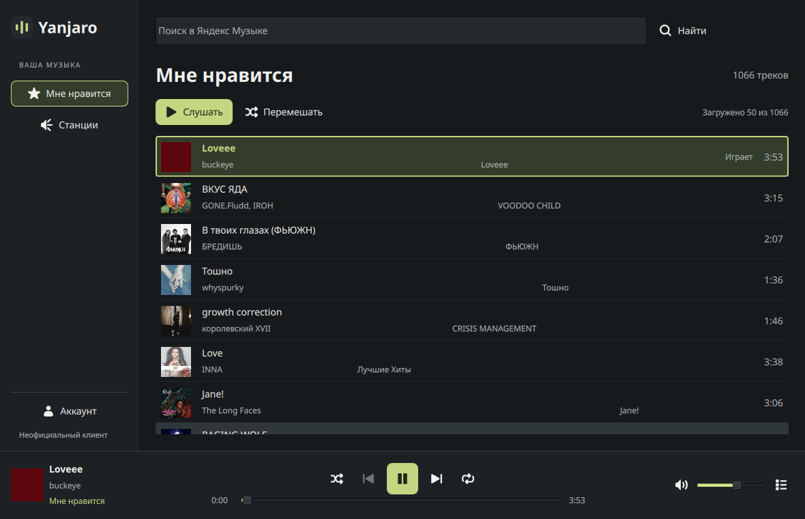
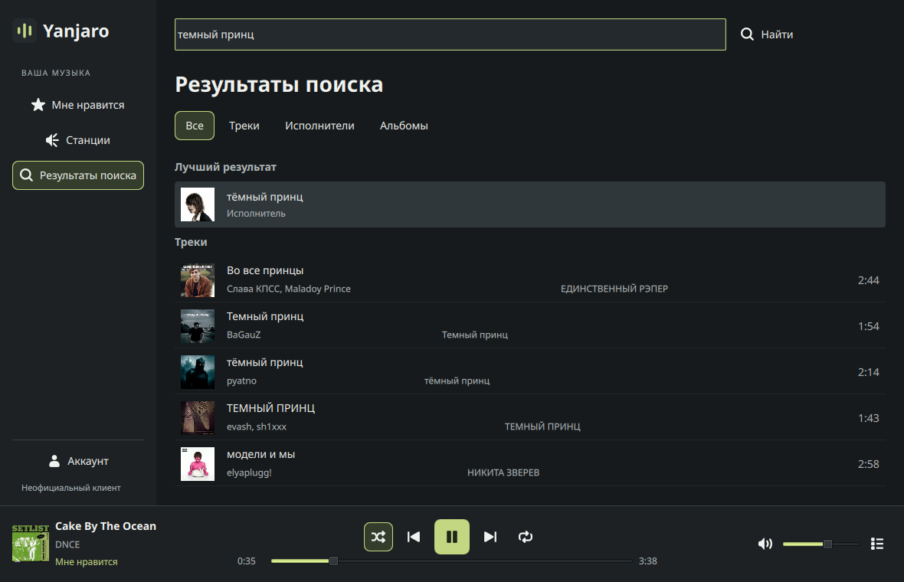
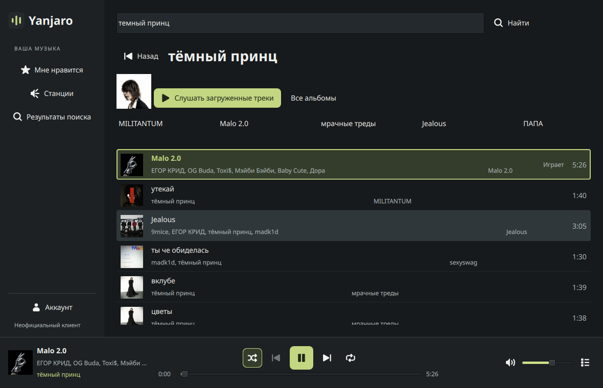
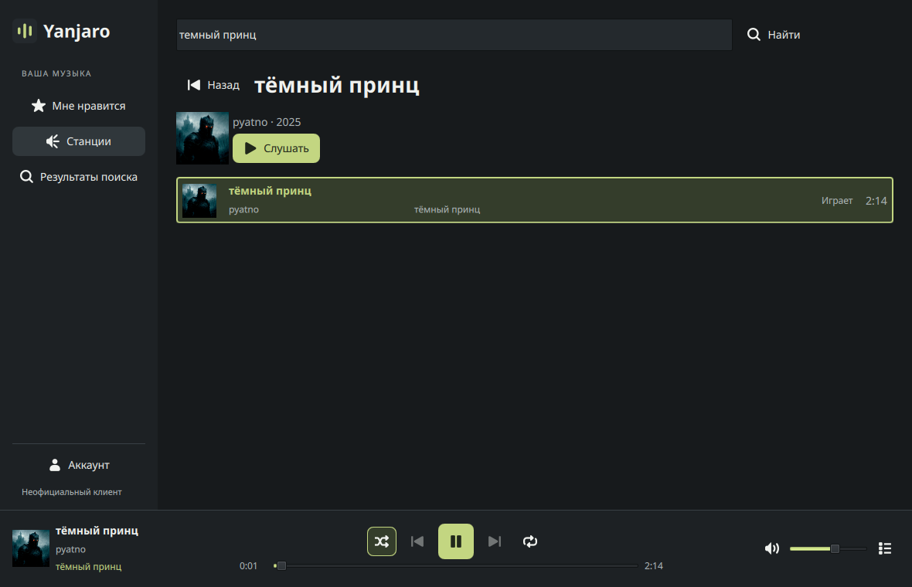
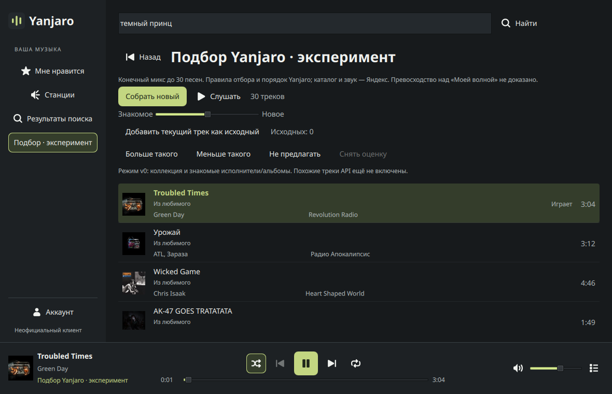
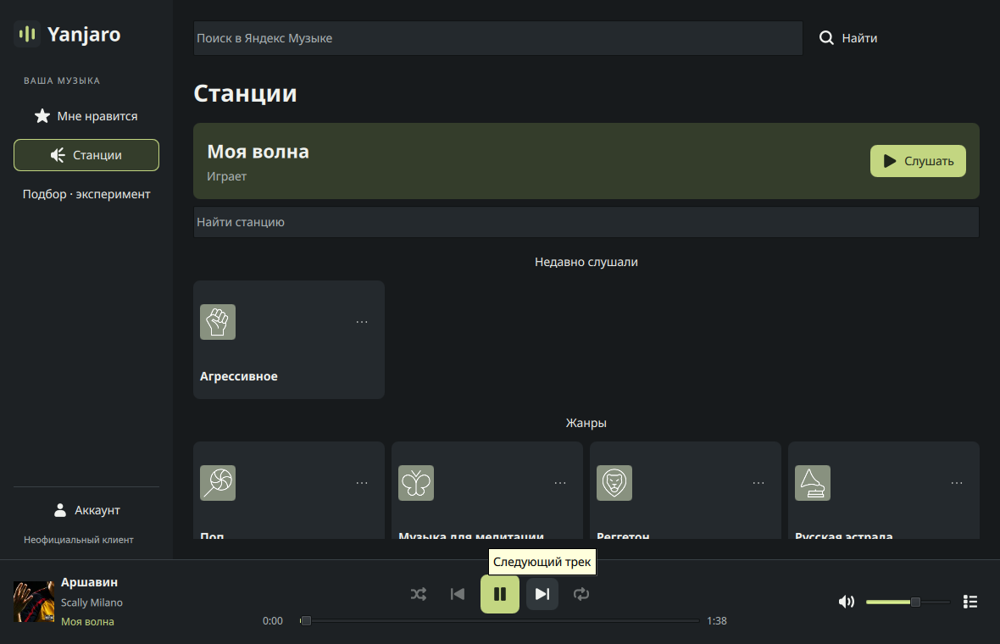

# Yanjaro Music

Неофициальный клиент **Yandex Music / Яндекс Музыки** для Manjaro: Python, PySide6 / Qt Quick, libmpv и yandex-music 3.2.0. GPL-3.0-or-later. Репозиторий: [zinverno/yanjaro](https://github.com/zinverno/yanjaro).

**0.2.0rc2 — локальный кандидат для проверки, не подтверждённый публичный выпуск.** Изменения продолжают рабочий UI rc1 в ветке `feature/player-polish-and-discovery`. Автоматические доказательства, живая приёмка и ограничения разделены в [VALIDATION.md](VALIDATION.md). Старые подтверждения rc1 не заменяют проверку нового пакета.

## Повседневное управление

- Один щелчок по строке или Enter запускает трек. Повторный выбор играющего трека его не перезапускает; выбор текущего на паузе продолжает с прежнего места. Ссылки на исполнителя/альбом открывают страницы без запуска строки.
- Нижний плеер остаётся по центру всего окна независимо от названия и боковой очереди. Состояние нижней панели, списка, очереди и MPRIS идёт из одного PlaybackController и подтверждённых событий mpv. Загрузка и ошибка выделены отдельно.
- Конечная очередь: shuffle оставшихся элементов, Previous по фактическим переходам, repeat off/all/one. Repeat-one действует при естественном конце; ручной Next переходит дальше. Shuffle-off восстанавливает исходный порядок остатка. Любимое использует полный список ID, не только первые 50 строк.
- В станциях порядок и продолжение задаёт радио Яндекса: **repeat/shuffle отключены**, предпочтения конечной очереди сохранены. Подгрузка автоматическая, с защитой от чужих/поздних ответов и явным повтором после ошибки.
- Поиск имеет вкладки Все / Треки / Исполнители / Альбомы. «Все» показывает лучший результат и короткие секции, полная пагинация — на отдельных вкладках. Исполнитель открывает треки и альбомы, альбом — трек-лист в порядке дисков. Назад сохраняет запрос, вкладку и прокрутку. Навигация не заменяет играющую очередь. Для исполнителя кнопка честно относится к загруженным трекам.
- Станции сгруппированы по стабильным ID/родителям; неизвестные остаются в «Других». Закрепления, скрытие сверху и недавние станции локальны и разделены по аккаунтам. Это не синхронизация pins Яндекса. Порядок обновляется при открытии раздела, поиск охватывает весь каталог. Изображения асинхронные, есть SVG-заглушки и ограниченный кэш.
- Ctrl+F / Ctrl+L — поиск, пробел — плеер вне текстового ввода. Перетаскивание позиции отправляет перемотку при отпускании. Сворачивание сохраняет звук, закрытие завершает приложение.

## Сохранение входа и MPRIS

«Запомнить аккаунт на этом устройстве» включено по умолчанию. Токен хранится **только в системном Secret Service** через явный backend SecretStorage. При недоступном/заблокированном хранилище показаны повтор и возможность войти только на сеанс; успешная запись не имитируется. Ошибка сети не удаляет запись, HTTP 403 не считается доказательством недействительного токена. Выход удаляет запись Yanjaro и инвалидирует старые ответы. После восстановления аккаунта музыка сама не запускается.

MPRIS предоставляет `org.mpris.MediaPlayer2.yanjaro` для штатной карточки и управления оболочкой. Команды используют тот же контроллер; произвольные URI и удалённый TrackList не поддерживаются. **Расположение карточки, настоящий Secret Service и медиаклавиши требуют живой проверки в пользовательском сеансе.** Подробности и короткие команды: [DESKTOP-INTEGRATION.md](docs/DESKTOP-INTEGRATION.md).

## Подбор Yanjaro · эксперимент

Явно включается в настройках аккаунта. Конечный микс до 30 песен: кандидаты из коллекции и знакомых исполнителей/альбомов, локальные фильтры и порядок Yanjaro. «Моя волна» для генерации не вызывается. Есть баланс знакомого/нового, локальные «Больше/Меньше такого», запрет, снятие оценки, исходные треки и очистка. Эти оценки не меняют лайки Яндекса.

Запросы и профиль ограничены; выключение прекращает сбор и дальнейшие запросы. История Яндекса не требуется. Similar endpoints до живой проверки отключены. Качество **не оценено**, превосходство над «Моей волной» не доказано. [Алгоритм, лимиты и хранение](docs/EXPERIMENT.md).

История Яндекса остаётся скрытой; её код сохранён. Офлайн, синхронизация устройств/Ynison, lossless, изменение лайков и публичная публикация в эту задачу не входят.

## Запуск и сборка

В подготовленном изолированном окружении:

```sh
./run.sh
```

Для нового окружения Linux x86_64 с libmpv >=0.41:

```sh
uv venv --python 3.13 .venv
uv pip install --python .venv/bin/python --require-hashes -r requirements.lock
./run.sh
```

Приложение не устанавливает зависимости при запуске. Системный Python для разработки не меняется. `.venv` и `.runtime` не входят в пакет. Зависимости native package, включая SecretStorage/Jeepney, объявлены в PKGBUILD; их версии доступны в каталогах Manjaro Stable и Arch Extra. SDK включён отдельно из официального wheel с SHA-256. AUR-зависимостей у рецепта нет.

```sh
./scripts/build-native.sh
```

Кандидат упаковки: `dist/native/yanjaro-0.2.0rc2-3-any.pkg.tar.zst`, контрольная сумма рядом. На компьютере владельца установлен и принят `rc2-2`; новая ревизия исправляет атрибуцию и материалы выпуска, код Python/QML прежний. `.SRCINFO` генерируется makepkg; источник — существующий локальный архив, не выдуманный тег. Установка нового кандидата на основной системе требует отдельного согласования. После установки запуск из меню **Yanjaro Music** либо:

```sh
/usr/bin/yanjaro
```

[Установка, обновление, удаление и выпуск](docs/RELEASE.md). Пакет не является автономным установщиком со всеми зависимостями. На 2026-10-08 репозиторий уже публичный; владелец отдельно разрешил отправку проверенной ветки и PR. Агент не менял публичность. Merge, теги, Release и AUR не выполнялись.

## Проверки и снимки

```sh
QT_QPA_PLATFORM=offscreen .venv/bin/python -m unittest discover -s tests -v
.venv/bin/pyside6-qmllint yanjaro/*.qml
desktop-file-validate packaging/yanjaro.desktop
python3 scripts/check-package.py dist/native/yanjaro-0.2.0rc2-3-any.pkg.tar.zst
```

Тесты используют синтетические API/хранилище, настоящий Qt Quick и настоящий libmpv с локальным WAV и `ao=null`. Это не проверка слышимого звука и не аккаунт. `tests/render_ui.py` проверяет центр/границы при 1024×700, 1366×768, 1920×1080 и масштабах 1/1.25/1.5; снимки явно помечены SYNTHETIC.

Ниже — **реальные снимки установленного rc2-1** из согласованной приёмки. В них нет кода входа, аккаунтных идентификаторов или системных уведомлений; видны выбранные владельцем песни. Звук и системная карточка подтверждались отдельно. Сетевое исправление rc2-2 не считается проверенным этими снимками.







Отдельно — станции с играющей волной в установленном rc2-2:



Снимок настоящей карточки ОС пока не получен, её работу владелец подтвердил отдельно. Исторические снимки rc1 сохранены в `docs/screenshots/`; синтетические кадры не выданы за живую интеграцию.

Для новых живых снимков после согласованной установки:

```sh
/usr/bin/yanjaro --capture-ui "$HOME/Pictures/yanjaro-rc2-review"
```

Режим явно сохраняет непустые экраны после входа при загруженном треке: любимое, поиск по типам, исполнителя, альбом, станции и эксперимент. Числовой `acceptance.json` не содержит ID аккаунта/треков/партий, токенов и URL. Для регрессии волны нужно `wave_distinct_batches_played_max >= 3` вместе с подтверждением звука. Снимок карточки ОС делается отдельно в настоящей оболочке; приложение его не рисует. Перед публикацией проверить личные данные, особенно уведомления рабочего стола.

## Границы данных

API работает в worker; модели SDK с авторизованным client не передаются в QML. События mpv приходят в Qt через queued signals и проверяются по ID файла. Секреты и временные аудиоссылки не выводятся в логи/MPRIS. Настройки — XDG config, локальные данные по аккаунту — XDG state, публичные обложки — XDG cache (32 МБ), IPC — XDG runtime. Пользовательские данные не включаются в wheel/sdist/native package.

Источники контрактов и сведения о компонентах: [WORK-rc2.md](docs/WORK-rc2.md), [LICENSE-STATUS.md](LICENSE-STATUS.md). Yanjaro не является официальным продуктом Яндекса или Manjaro.


## Первый тестовый выпуск: подготовка

Yanjaro — неофициальный клиент, не средство обхода условий доступа сервиса. Нужен аккаунт Яндекса, которому сервис разрешает полный трек в текущем регионе; может требоваться действующая подписка. Приёмка выполнена на аккаунте владельца с доступом к полным трекам, тип тарифа не фиксировался. Доступ для любого аккаунта не обещается; превью не подменяют полное аудио.

Авторизация и каталог обращаются к API Яндекса; обложки — к публичным CDN Яндекса; libmpv получает временную аудиоссылку сервиса. Клиент отправляет сервису отчёты прослушивания и feedback настоящих станций. Отдельной аналитики Yanjaro, автообновления и внешнего backend в проверенном коде не найдено; это результат чтения исходников, не полный сетевой захват. Эксперимент использует кандидатов каталога и местные правила, не обещая превосходства над «Моей волной».

[Новая матрица подготовки и оставшиеся шаги](docs/PUBLIC-TEST-PREP.md), [локальный текст будущего тестового выпуска](docs/TEST-RELEASE-DRAFT.md). Две независимые чистые проверки, если Docker уже доступен пользователю:

```sh
./scripts/check-clean.sh arch
./scripts/check-clean.sh manjaro
```

Команды скачивают официальные базовые образы и зависимости только в одноразовые контейнеры. Они не меняют пакеты основной ОС, не используют её Python/Qt, связку ключей, аудиоустройства или исходную папку для запуска установленного приложения. Результаты — `dist/clean/<дистрибутив>/<время>/`; Docker socket в sandbox агента недоступен. Наличие сценария не означает PASS.
