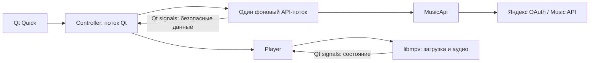

# Yanjaro Music

Основа отдельного клиента Яндекс Музыки для Manjaro: Python, PySide6 / Qt Quick и libmpv. Один экран с библиотекой, поиском, станциями, историей и плеером.

**Статус: автоматические проверки пройдены. Пользователь подтвердил вход, библиотеку, поиск, полный трек, паузу, перемотку, станции, волну и следующую партию. Существующая серверная история читается, но новые прослушивания в ней не появились даже после повторной проверки.** Точные границы проверки — в [VALIDATION.md](VALIDATION.md). В приложении нет демонстрационных треков и обхода авторизации.

## Запуск в подготовленном каталоге

```sh
cd /home/zinvernix/projects/yanjaro-music
./run.sh
```

Запускайте из обычного терминала рабочего стола. Сетевой sandbox среды разработки может запрещать DNS / подключения к Яндексу.

На этой машине Python-зависимости находятся в `.venv` (Python 3.13.13); libmpv и три недостающие библиотеки — в `.runtime/usr/lib`. Системный Python и системные пакеты не изменялись. `run.sh` добавляет локальные библиотеки только в окружение запускаемого процесса.

## Установка в чистое окружение

Нужны Python 3.11–3.14, libmpv и библиотеки графической сессии. На Manjaro libmpv поставляется пакетом `mpv`. Если он уже установлен, `.runtime` не требуется. Локальная копия из текущего каталога зависит от ABI установленных системных библиотек; это не переносимый бинарный комплект для любого Linux.

С установленным `uv`:

```sh
uv venv --python 3.13 .venv
uv pip install --python .venv/bin/python --require-hashes -r requirements.lock
./run.sh
```

Либо стандартный venv, без установки чего-либо в системный Python:

```sh
python3 -m venv .venv
.venv/bin/python -m pip install --require-hashes -r requirements.lock
./run.sh
```

`requirements.lock` фиксирует версии и SHA-256 колёс для Linux x86_64. PySide6-Essentials содержит используемые Qt Quick / Controls; пакет Qt WebEngine не нужен. Для воспроизведения необходим именно libmpv; при его отсутствии окно покажет ошибку и не будет имитировать плеер.

## Проверка с аккаунтом

1. Нажать **«Войти через браузер»**. Откроется страница Яндекса; ввести показанный в приложении код и подтвердить доступ. Пароль вводится только на странице Яндекса. Вход можно отменить; код имеет срок действия.
2. После входа автоматически загружается **«Мне нравится»**. Метаданные подгружаются по 50 треков, кнопка «Показать ещё» продолжает список. Отсутствующие метаданные явно отмечены.
3. Ввести название песни, нажать **«Найти»**, выбрать результат. Нужен трек, доступный аккаунту и региону. Обычно полный доступ требует соответствующей подписки.
4. Проверить звук, **паузу**, возобновление и **перемотку за 30 секунд**. Для проверки полного прослушивания отдельно дождаться естественного конца трека без перемотки. Сам факт запуска или длительность в метаданных этого не доказывают.
5. Открыть **«Станции»**, проверить названия из сервиса. Нажать **«Моя волна»** или выбрать станцию: запускается первый доступный трек партии.
6. **«Следующая партия →»** пропускает текущий трек, запускает следующий из очереди и запрашивает продолжение. При пустой очереди повторяет запрос партии. Сообщение «Следующая партия волны получена» означает успешный ответ; партия может содержать повторы или не добавлять новых доступных треков. При естественном конце трека волна продолжается автоматически.
7. Открыть **«История»**. Это история, возвращённая сервером аккаунта, а не локальный журнал клиента. API может вернуть элементы только с ID: они показываются без выдуманных названий. При окончании, смене трека или закрытии клиента отправляется фактическое время прослушивания через `play-audio`; паузы и перемотка не увеличивают это время. В истории отдельно показан результат отправки события текущего запуска. Успешный ответ сервера не доказывает появление записи: в нашей живой проверке новый трек не появился после полного прослушивания и повторного чтения истории. Обновление серверной истории этим клиентом не подтверждено.
8. **«Выйти»** останавливает музыку и удаляет токен из объектов клиента. После перезапуска нужно войти снова. Для отзыва самого разрешения используйте управление доступами Яндекс ID.

Если API отдаёт только `preview`, клиент отказывается воспроизводить фрагмент как полный трек. При каждом выборе заново запрашивается временная ссылка. Если ссылка истекла или сеть оборвалась, ошибка видна в окне; повторный выбор получает свежую ссылку. Поддержаны полные MP3 / AAC, возвращённые текущим API; поддержка других способов доставки не заявляется.

## Границы модулей



- `yanjaro/api.py`: единственный владелец SDK и токена, Device Flow, библиотека, поиск, выбор полного аудио, станции, партии и история. Не зависит от Qt или mpv.
- `yanjaro/controller.py`: сериализует сетевые вызовы в одном worker, передаёт данные в QML, управляет очередью волны и регистрацией фактических прослушиваний. События `radioStarted`, `trackStarted`, `skip`, `trackFinished` отправляются при соответствующих действиях; `batch_id` сохраняется для каждой записи очереди. Перемотка не засчитывается как время прослушивания.
- `yanjaro/player.py`: асинхронные команды libmpv и его события. Ссылка передаётся только движку; токен движку не передаётся. Сетевые вызовы SDK и ожидание OAuth не выполняются в потоке интерфейса.
- `yanjaro/Main.qml`: нативные Qt Quick Controls, состояние и пользовательские действия. Не содержит HTTP, токенов и ссылок на аудио.

Python/SDK HTTP-логи отключены, необработанные исключения не печатаются с чувствительными подробностями. У mpv отключены терминальные логи, сторонние скрипты, пользовательская конфигурация, сохранение позиции и дисковый кэш. Токен, refresh token и аудиоссылки не сохраняются приложением. История и метаданные тоже остаются в памяти. Это не обещание криптографического стирания памяти процесса.

Для библиотеки используется неофициальный `yandex-music 3.2.0`. В его `rotor_station_tracks` параметр `queue` затирает `settings2`; адаптер формирует этот GET через публичный `client.request` и десериализует результат типом SDK. Регрессионный тест подтверждает передачу обоих параметров.

Синхронизация устройств, Ynison, офлайн-загрузки, сохранение токена между запусками и дополнительные продуктовые экраны в эту основу не включены.

## Автоматические проверки

```sh
LD_LIBRARY_PATH="$PWD/.runtime/usr/lib${LD_LIBRARY_PATH:+:$LD_LIBRARY_PATH}" \
  .venv/bin/python -m unittest discover -s tests -v
.venv/bin/pyside6-qmllint yanjaro/Main.qml
```

Тесты API используют явно синтетические ответы и не обращаются к аккаунту. Desktop-тесты загружают настоящий Qt Quick и настоящий libmpv, создают временный WAV и используют `ao=null`: они проверяют аудиодвижок, но не физический звук и не стрим Яндекса. Нет скрытого скачивания музыки.

Источники контракта: [Device Flow](https://ym.marshal.dev/token/), [радио](https://ym.marshal.dev/yandex_music._client.radio/), [история](https://ym.marshal.dev/yandex_music._client.music_history/), установленный исходный код SDK 3.2.0 и `python-mpv 1.0.8`. Это не официальный поддерживаемый Яндексом API.
