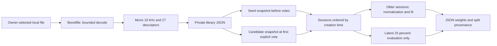

# Acoustic Intelligence v0.1 — experimental validation, 2026-10-08

**Decision: standalone research CLI is ready for owner-selected local trials. Recommendation quality on real music is NOT RUN. Keep the PR draft; no player integration.**

## Inputs and isolation

- Branch: `experiment/acoustic-lab-v01`, based on current `main` at `1c83c3776de565ed57416015f32a7ddd999af29f` (verified against GitHub before branching).
- Imported archive SHA-256: `e96fa3e00c7cdeae0b9e2afbdcdd52e7a67b25d071c66e7db4986f28fba86a36`.
- Archive imported intact in commit `de214b8`; subsequent commit contains reviewed fixes and evidence.
- Checkout: `/tmp/yanjaro-acoustic-work`. The provided workspace's `.git` is hidden by the managed environment, so a separate clone was required. Dedicated venv: `experiments/acoustic/.venv`; no system Python/package changes.
- All 134 files tracked on the base `main` are byte-identical. Only `START_HERE.md` and `experiments/acoustic/` are added. Root dependency files, player, packaging, release workflows and AUR are untouched.
- Published `v0.2.0rc4` points to `e9a094a7eb978fda1aaf9966dbf7d0b596276ab7`; Release ID `406754189`. No tags, release assets or AUR changes were made.
- No real recordings, Yandex audio, account tokens or personal feedback were read. No model or audio files are committed. The committed JSON contains only aggregate synthetic evidence.

## Architecture review



`yanjaro/recommend.py` remains the existing finite rule-based mix. Its controller calls `mix()` only through the existing opt-in experiment path; it does not import the acoustic package. The new package has no Yandex SDK, player or network client imports.

Extraction is sequential, uses the first 10–300 requested seconds (default 180), and produces nine global descriptors plus six buckets each for energy, rhythm and brightness. Files over the configured size are skipped. `--limit` bounds decode attempts including failures, not total directory enumeration. The STFT is shared by the spectral descriptors; the onset/beat pipeline is provided by librosa. These are descriptive measurements, not section, meter or emotion recognition.

The ranker scores `-weights @ distance`. Each explicitly positive/negative within-session pair contributes `distance(no) - distance(yes)`. It minimizes pairwise logistic loss with a rhythm-first L2 prior, nonnegative bounded weights, 900 fixed gradient steps, learning rate 0.035 and margin multiplier 3. No model downloads or neural network training occur. The optimizer is deterministic for a fixed set of snapshots and package environment.

Sessions are validated and sorted by timezone-aware creation timestamps, not JSON order. The newest `ceil(N/4)` eligible sessions are held out; at least six eligible sessions and four training pairs are required. Training feedback must finish strictly before the first held-out session starts. Context uses seed snapshots made before ratings; candidate snapshots are frozen at first vote. Reindexing cannot change historical fitting data. Repeated identical votes do not add pairs or change timestamps; corrected votes replace the label and update feedback time.

Normalization is fitted only on seed and rated-candidate snapshot rows in the training sessions. Repeated exposures contribute repeated rows. Both prior and trained weights use the same fitted scales in the holdout comparison. Neither holdout features nor holdout labels fit these scales or weights. The saved model uses the training partition only, with train/holdout session IDs recorded locally. There is no automatic refit on the evaluation set.

## PASS / FAIL / NOT RUN

| Check | Result | Evidence / limits |
|---|---|---|
| Archive's original suite before fixes | PASS | 9 tests, 52.411 s on first numerical run |
| Added regression checks against original code | FAIL → fixed | First probe: 13 tests, 14 failing subcases and 1 error; later probes reproduced decoder fallback and multi-seed BPM averaging failures |
| Final laboratory suite | PASS | 30 tests, 5.169 s; no skipped or disabled checks |
| Dedicated installation / dependency consistency | PASS | `uv pip install --python .venv/bin/python -e .`; `pip check`; first `pip` attempt failed due to sandbox DNS, not code |
| Module and installed CLI `--help` | PASS | Both entry points return 0 |
| End-to-end offline CLI | PASS | 36 commands on 12 generated WAVs; list, index, cache, sessions, votes, training, baseline/learned recommendations |
| Missing/empty audio, silence, corrupt input, nonfinite samples | PASS | Explicit errors; no model created from empty state; stereo downmix/resampling/duration check |
| IDs, schema, corrupted JSON/model, duplicate feedback | PASS | Clean errors; corrupt model cannot silently become baseline; weights finite/nonnegative, scales positive |
| Index bounds and storage failures | PASS | Failed decodes consume limit; partial indexing exits 2; write errors abort, preserve old JSON and clean temporary files |
| Privacy / network in tested pipeline | PASS | Python socket audit rejects network; observed 0 attempts; no Yandex SDK import; only mode-0600 JSON in temporary workspace |
| Chronology and leakage regressions | PASS | Reordered JSON produces same split; holdout labels/features and unrelated library tracks cannot alter fitted weights/scales; late training edits rejected |
| Reproducibility | PASS | Two fits give identical weights and metrics; repeated extraction identical in same environment |
| Existing Yanjaro experiment regressions | PASS | 3 tests, 0.060 s, existing Python 3.13 environment, offscreen Qt and fake API |
| Base player / packaging source preservation | PASS | All 134 original files byte-identical to base main |
| Full desktop/distribution/AUR validation | NOT RUN | Existing runtime and packaging unchanged; no release operation requested |
| Python 3.11–3.13 / other operating systems for acoustic lab | NOT RUN | This lab environment is Python 3.14.7 on Linux |
| Real permitted recordings, real explicit sessions | NOT RUN | Owner has not selected or authorized files for this run |
| Preference quality vs baseline / existing Yanjaro | NOT RUN | Synthetic labels cannot establish human preference quality |

### Reproduced fixes

1. Normalization on the entire library leaked holdout-only/unrated descriptors into training. Fit it after the session split using training snapshots only.
2. Mutable ID-only contexts changed after reindexing; JSON order was treated as chronology. Schema **2** adds snapshots and feedback timestamps. Old schema 1 is rejected, not silently migrated.
3. Failed decodes did not consume `--limit`; CLI reported success even on errors; disk failures were classified as audio failures after incrementing the success count. Separate those paths and count attempts.
4. Interrupted/failed writes could leave private temporary files; nonstandard NaN JSON was accepted. Cleanup occurs in `finally`, with finite JSON serialization and atomic replacement.
5. Invalid nested state and malformed model vectors could crash, produce NaN rankings or silently select baseline. Validate these boundaries and load model files through the versioned reader.
6. Averaging 70/140 BPM seeds created 105 BPM. Average octave-aware tempo distances instead; unknown BPM and zero-weight dimensions are not presented as exact matches.
7. `librosa.load(path)` could fall back to an external decoder for malformed/unsupported files. Decode local bytes directly with the already-used soundfile/libsndfile backend, then resample with librosa. Unsupported codecs fail explicitly.
8. The experimental build backend minimum is now setuptools 77, matching its SPDX license-expression metadata; root packaging is unchanged. Soundfile is declared as a direct experiment dependency because the extractor now calls it directly.

## Measured synthetic results

Full machine-readable output: [validation/synthetic-smoke.json](validation/synthetic-smoke.json). Dependency snapshot: [validation/environment.txt](validation/environment.txt).

| Measurement | Result |
|---|---:|
| Generated WAVs / seconds per WAV | 12 / 12 |
| Analyzed seconds per WAV / descriptors | 10 / 27 |
| New files processed / errors | 12 / 0 |
| Cached run processed / skipped | 0 / 12 |
| Index duration / cache duration | 5.768 s / 0.004 s |
| Model fitting duration | 0.046 s |
| Scripted train / holdout sessions | 6 / 3 |
| Train / holdout positive-negative pairs | 6 / 3 |
| Baseline holdout pair accuracy | 1.0000 |
| Learned holdout pair accuracy | 1.0000 |
| Separate optimizer control: baseline / learned | 0.0000 / 1.0000 |

The optimizer control deliberately repeats a manufactured brightness preference opposed to the rhythm prior. It proves weights can learn a changed ordering; it is not an independent music quality benchmark. All timings are local measurements, not laptop performance guarantees; the first import/JIT run is slower.

The 60/120/180 BPM pulse fixtures produced approximately **60.484 / 117.188 / 89.286 BPM**. The last is a half-time estimate. Octave-aware distance mitigates ranking sensitivity but does not correct or verify the displayed BPM. No full-song structural or tempo accuracy claim follows.

## Remaining limits and next stage

- Single-writer local prototype: atomic JSON replacement is not a multi-process transaction or a power-loss durability guarantee. Workspaces can contain private paths and session labels; do not attach them to the PR. Use a small selected audio folder; scanning and pair construction are not designed for large catalogues.
- Dataset split is by listening session, not artist, recording or content hash. The same tracks can appear in train and holdout; this evaluates another session on a personal library, not cold-start songs. Duplicated files/near-duplicate sessions and selection from baseline recommendations can inflate results. Current pooled pair accuracy weights sessions with more pairs more strongly; ties count as 0.5.
- Finite handcrafted descriptors omit timbre embeddings, structure uncertainty and perceptual loudness calibration. Nonnegative distances cannot learn a preference for contrast on a feature. The fixed regularization/steps were not tuned against real data.
- **Next:** owner selects 10–20 permitted files outside Git and explicitly authorizes indexing. Record provenance/permission locally, check decoding duration, failures, estimated tempo (including half/double-time) and resource costs. Do not acquire Yandex streams.
- Collect at least six complete chronological sessions with seed choices made first and both positive/negative non-seed judgments; target **15–30 independent, varied sessions**. Record neutral/unrated outcomes by leaving candidates unlabeled; never turn skips into negatives. Avoid reediting training feedback after evaluation begins.
- Freeze feature schema, library, training rules and holdout boundary before comparison. Report session/track counts, failures, coverage, pooled and per-session pair accuracy, and uncertainty by resampling sessions; assess duplicate/artist overlap. Reserve fresh sessions if the model is revised after looking at results.
- Compare fixed prior and learned ranker on the same permitted candidate sets with order-balanced or blinded explicit listening judgments. Only with the owner's separate participation compare the existing Yanjaro shuffle/experiment; do not infer its quality from these acoustic tests.
- Consider UI/feature lookup design only after those trials and an authorized source of catalogue descriptors exist. No player imports, service download pipeline, release, tag or AUR action is part of this PR.

## Reproduction

From the standalone checkout:

```sh
cd experiments/acoustic
python3 -m venv .venv
.venv/bin/python -m pip install -e .
# Alternatively: uv pip install --python .venv/bin/python -e .
.venv/bin/python -m pip check
.venv/bin/python -m unittest discover -s tests -v
.venv/bin/python -m acoustic_lab --help
.venv/bin/yanjaro-acoustic --help
.venv/bin/python scripts/synthetic_smoke.py
```

The environment snapshot records the tested versions, not a cross-platform lockfile. Original player checks used `QT_QPA_PLATFORM=offscreen` and the existing player venv with `python -m unittest discover -s tests -p test_experiment.py -v` from the repository root.

Method references: [scikit-learn leakage guidance](https://scikit-learn.org/stable/common_pitfalls.html#data-leakage) supports splitting before fitting preprocessing; [librosa 0.11 beat tracker](https://librosa.org/doc/0.11.0/generated/librosa.beat.beat_track.html) defines the estimated tempo/beat output; [librosa loader](https://librosa.org/doc/0.11.0/generated/librosa.load.html) documents decoder choices; [setuptools metadata support](https://setuptools.pypa.io/en/latest/userguide/pyproject_config.html) specifies SPDX support from version 77. These sources describe the underlying methods, not evidence of this model's recommendation quality.
