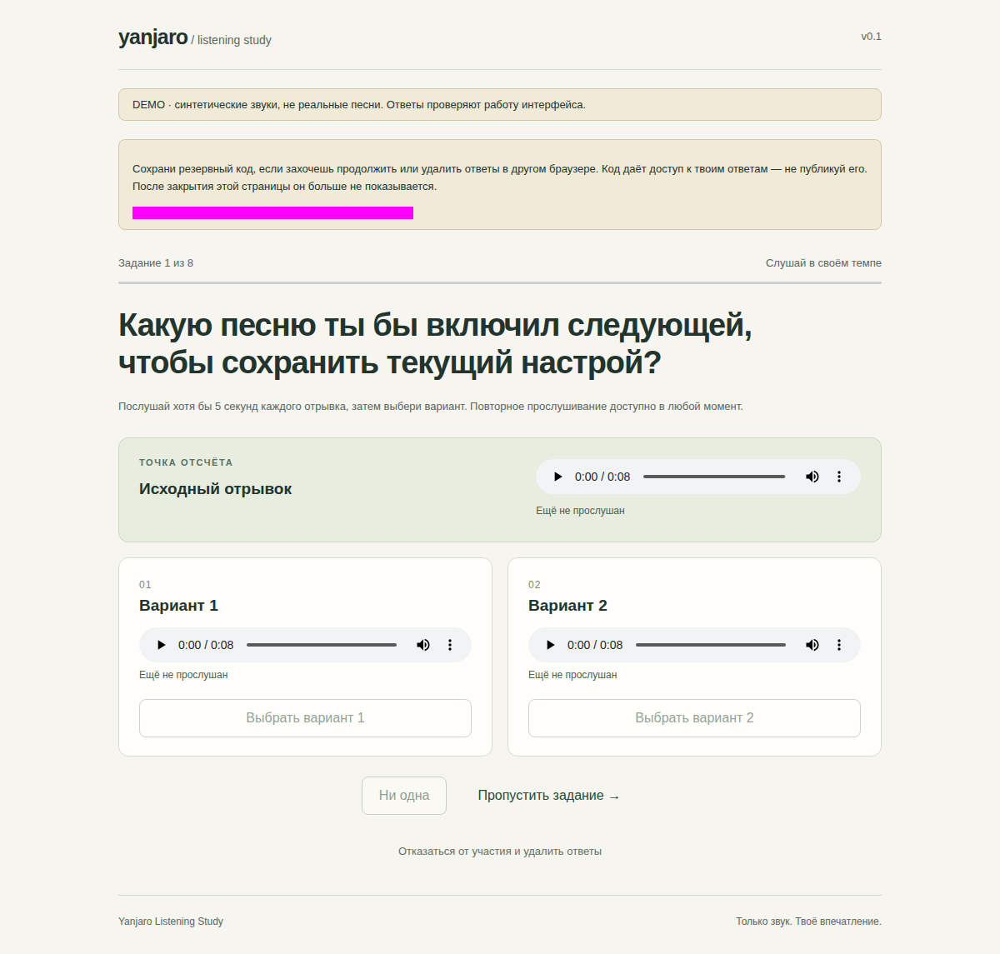
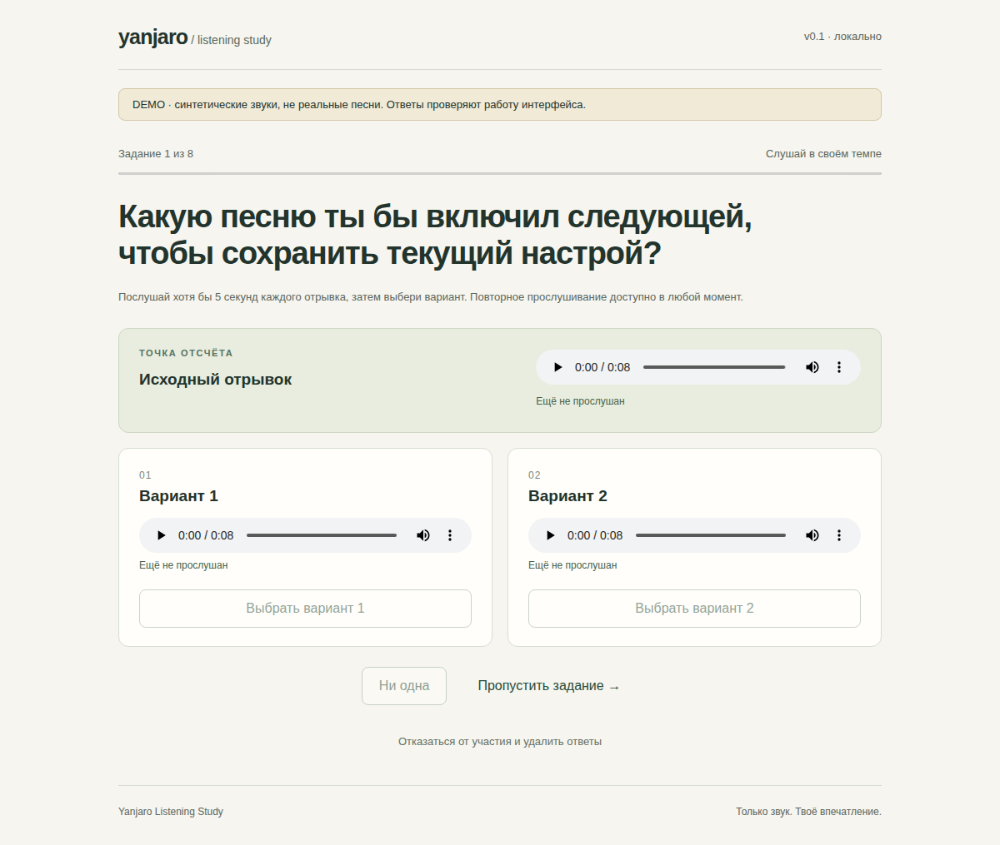

# Validation — first real audio and private researcher review

Continued from requested HEAD `5e25b22cc4223b45528b6316de411be6dc50676c`. [Real audio report](REAL_AUDIO.md) and [sanitized measurements](validation/real-audio-v1.json) are separate from synthetic UI/test evidence.

| Gate | Status / evidence |
|---|---|
| Primary publication / permitted acquisition | PASS for 10 exact OGA File(s) attachments, explicit CC0 checked before download; matching byte lengths, original and clip SHA-256, private dated evidence; no album/crawler download |
| TRG Banks t01–t04 acquisition | BLOCKED; 403 from the four supplied normal individual FLAC links; no retry, stream extraction, alternate format/master or access workaround |
| Real decoding / preparation / explicit features | PASS technically; 10 full decodes, 10 fixed 15 s windows, raw and rendered features, original/rendered quality diagnostics; audible artifacts remain NOT RUN |
| Existing screen-v1 on actual features | PASS execution; A/B/C/D counts all zero, 56 unknown-tag and 8 uncertain directed pairs, zero triples; thresholds unchanged |
| Eight real triples ready | FAIL; insufficient recordings/authors and no qualifying pairs |
| Independent researcher review | New offline two-file UI; separate local drafts/JSON, per-recording and per-pair judgments, BPM/similarity errors, no automatic approval; files outside Git |
| Human review / perceptual validation / real freeze | NOT RUN; all real results PROVISIONAL |
| Public service, paid resources, participant recruitment | NOT RUN; not authorized in this iteration |

The first new review browser run [37916899201](https://github.com/zinverno/yanjaro/actions/runs/37916899201) caught horizontal overflow in mobile WebKit; existing standalone/collection suites passed. [Diagnostic run 37918980278](https://github.com/zinverno/yanjaro/actions/runs/37918980278) isolated native select rendering: 625 px internal overflow inside a 358 px field; hiding selects alone restored the 390 px document. The fix uses bounded select styling with an explicit caret, preserves the width assertion and verifies mobile selection/playback/export. The import harness also waits for asynchronous file reading before assertions. Exact final HEAD, test counts and final CI conclusions are recorded in [PR #9](https://github.com/zinverno/yanjaro/pull/9) after completion; no success is inferred from an earlier head. All new CI review audio/decisions are synthetic. Actual-device/Zen/headphone acceptance remains NOT RUN.

---

# Historical validation — pool audit and CI preparation

Continued from the exact requested PR #9 HEAD `ad4f5d3c4e18059e64cb8913c6b4792772d59961`. No experiment deployment or real audio acquisition.

| Gate | Status / evidence |
|---|---|
| Cancelled CI diagnosis | PASS; [run 37897137055](https://github.com/zinverno/yanjaro/actions/runs/37897137055), job 113710939443: unit checks succeeded; 07:06:37–07:16:37 UTC installation exhausted the 10-minute job budget while apt was still downloading Ubuntu packages; browser checks skipped, artifact contained only the synthetic analysis report |
| CI organization repair | PASS at `325fe137b603c8b5109ecb7e57ee13dd09b7a175`; [run 37908440745](https://github.com/zinverno/yanjaro/actions/runs/37908440745): both synthetic and browsers jobs succeeded, including both existing browser suites |
| Updated pool local checks | PASS; 52 Python tests, including retained 24 IDs, 36–60 bound, author groups, evidence scopes, unknown features/rights and CSV separation of source hints from unfilled human observations |
| Original 24 publication audit | PASS as evidence audit; 21 differing statements, 3 index-only/unavailable exact sources. No claim that differing statements revoke CC0 |
| Expanded pool | PASS as review inventory; 44 named recordings, 9 author groups; 10 exact publication pages + 4 named-album CC0 statements, 23 differing statements, 7 index-only records |
| Real masters / 6 A/B + 2 C/D validation | NOT RUN; zero acquired files, zero measured excerpts, zero accepted triples. Counting publications is not a musical feasibility result |
| Public launch / recruitment | NOT RUN; no deployment, paid resource, audio publication or participant contact |

The cancelled installation did not show a browser assertion failure. Splitting out the browser job preserves independent unit feedback. Within its 45-minute job budget, fixture preparation and npm each have 3 minutes, system packages 20, browser binaries 5, each browser suite 5; the remaining margin allows runner setup and artifacts. Both Chromium and WebKit remain required; no `continue-on-error`, cache-hit bypass or reduced test list. Reports are separate per job and exact PR head. This follows [Playwright CI guidance](https://playwright.dev/docs/ci) to provide an environment with browsers/system dependencies and leave timeout margin; no image/version or player dependency change was needed.

The repair run predates the pool fixture changes; **final-head acceptance is recorded in the PR body and [PR #9 checks](https://github.com/zinverno/yanjaro/pull/9/checks), not inferred from this earlier success**. Historical screenshots below remain explicitly tied to their original successful run. Final validation must include both study jobs plus existing distribution jobs at the new head.

Local `/tmp` space exhaustion was handled by removing only this study's disposable wheel/cache directories and four verified synthetic demo fixtures; source checkout, virtual environment and versioned artifacts were preserved. Local socket/browser restrictions remain, so real browser acceptance comes from GitHub Actions.

---

# Historical validation — recruitment preparation

All audio, sessions and screenshots in automated checks are **synthetic demo**, not listeners. Continued from the exact user-specified draft PR #9 HEAD `3eacfc819deeeb507c25c286bed3deacc7ea204e`; main was `1c83c3776de565ed57416015f32a7ddd999af29f`. Same experimental branch, no rewrite/merge of #6/#7.

| Gate | Status / evidence |
|---|---|
| Local Python checks | PASS; 51 tests covering old study invariants plus collection, concurrent allocation, retry, resume, erasure, retention, closed intake and shortlist unknowns |
| Collection browser acceptance | PASS at `6848ae227d257ab79cd278d6a3559847d4b5a68a`; [run 37896667242](https://github.com/zinverno/yanjaro/actions/runs/37896667242), 13 scenario groups, Chromium 153.0.8010.12 and WebKit 26.6 (iPhone 13 profile), zero external page requests / JS errors |
| Existing standalone demo browser acceptance | PASS in same run, 17 checks; memory-only export still works independently |
| Loss/recovery cases | PASS; real WAV, actual HTTP/SQLite, lost acknowledgement **after** commit, retry without duplicate, tab close + process restart, new-browser recovery/revoked old cookie, completion failure/retry, mobile withdrawal failure/retry |
| Real music shortlist | PASS as research inventory: 24 named records / 3 creators, declared CC0-1.0, exact source/evidence levels, private listening CSV; no audio/feature fabrication |
| Admission of 24 real clips | NOT RUN; no files acquired, rights receipts/individual track checks and human review still pending |
| Ready to recruit publicly today | **FAIL**; approved real stimuli, production HTTP/HTTPS acceptance, responsible operator/contact and 3–5-person pretest not completed |
| Actual Android/iPhone/Zen + headphones | NOT RUN; emulation cannot establish physical-device/audible acceptance |
| SurveyCircle listing/code redemption, public TLS/load/provider logging | NOT RUN; no listing/deployment/account/payment performed |
| Existing Yanjaro / Release / AUR / Render / Yambda training | NOT RUN; untouched/out of scope |

The evidence above identifies its tested code, including direct aggregate analysis, UTC expiry, idle purge, permanent intake closure, cross-site recruitment navigation and clearing old error messages after a successful retry. Visual review caught the stale-error issue before this run; completion and withdrawal now assert an empty error status after success. The workflow tests each subsequent exact PR head; consult [PR #9 checks](https://github.com/zinverno/yanjaro/pull/9/checks) for final-head status, not this historical run alone.

New acceptance harness: `tests/collection-browser.cjs`; [machine-readable evidence](validation/collection-checks.json). The final launch gates, retention policy and neutral invitation are in [LAUNCH.md](LAUNCH.md). License evidence and unresolved checks are in [CANDIDATES.md](CANDIDATES.md). Direct FMA opens returned 403; primary FMA search-index records and artist pages are explicitly distinguished from archived rights clearance.



[Mobile WebKit](validation/screenshots/collection-mobile.png) · [Completed collection](validation/screenshots/collection-finished.png). Browser screenshots from the cited run; only the random demo recovery code is masked by Playwright (magenta), no image editing.

Reproduce from this directory: `python -m unittest discover -s tests -v`, generate a fresh `demo`, then run both `tests/browser.cjs` and `tests/collection-browser.cjs` with Playwright 1.63.0 + Chromium/WebKit. Local socket/browser restrictions remain; real HTTP/browser evidence is from CI, not an unrun local browser. Artifacts allow only synthetic screenshots/check summaries/aggregate metrics; never upload SQLite, real clips, cookies, raw answers or SurveyCircle codes.

---

# Historical validation — original offline v0.1

All input audio and answers in these checks are **synthetic demo**. No human listening results or real MTG audio were obtained. User explicitly limited this iteration to demo and pilot preparation.

| Gate | Status / evidence |
|---|---|
| Live main / #6 / #7 source inspection | PASS; exact SHAs in SOURCES.md |
| Separate branch from main | PASS; `experiment/listening-study-v01` |
| Local Python behavior tests | PASS; 34 tests, no skips (selection, aliases, unknowns, rights, frozen review, counterbalance, anonymous input, metrics, degenerate CI, cross-trial duplicates, versioned taskset) |
| Synthetic extraction/demo/analysis | PASS; 24 generated 8 s WAVs, 6 A/B + 2 C/D tasks, 16 scripted participants per wording |
| No network during demo extraction | PASS; test rejects every socket construction while building complete demo |
| JS syntax / dependency consistency | PASS; `node --check`, `uv pip check` |
| Local HTTP and local Chromium launch | NOT RUN to acceptance; sandbox denies socket operations with EPERM before page execution |
| Hosted browser/HTTP synthetic workflow | PASS; [run 37892275362](https://github.com/zinverno/yanjaro/actions/runs/37892275362), 17 checks, Chromium 153.0.8010.12, 0 external page requests, 0 JS errors |
| Desktop/mobile UI visual review | PASS; actual CI screenshots below, no song metadata, visible DEMO label, no horizontal clipping at 390 px |
| Real permitted music / listener pilot / hypothesis | NOT RUN, by explicit scope |
| Zen/Linux, Firefox, audible-device listening | NOT RUN; Chromium evidence cannot replace these |
| Existing player desktop tests in isolated study venv | NOT RUN successfully; attempted root discovery failed importing intentionally absent Qt/Yandex dependencies |
| Player / release / AUR / Render / Yambda training changes | NOT RUN; outside scope |

Environment: Python 3.13.13, NumPy 2.5.3, soundfile 0.13.1, cffi 2.1.1, pycparser 3.0. Local PyPI DNS was unavailable: the separate venv was installed offline from existing cached wheels reconstructed from their cached unpacked distributions. `uv pip check` passes. This is local functional evidence, not a clean package build. Hosted workflow installs the pinned requirements independently.

One initial numeric test found a tiny asymmetric floating-point tempo distance when swapping arguments. The implementation now computes `log2(max/min)`; the exact-symmetry assertion passes. Initial synthetic preparation also exposed overly broad dynamics from digital silence; the extractor now uses documented −80 dBFS floor and excludes silent frames from spectral means. Neither correction used human responses.

The first hosted run [37892040095](https://github.com/zinverno/yanjaro/actions/runs/37892040095) was **FAIL** in the invalid-Host test: Fetch did not deliver the overridden Host header. All preceding actual UI interactions had passed. The same 403 assertion now uses Node's explicit HTTP header API; repeat run passed without weakening the application check. That passed run corresponds to branch HEAD `94cf42dada79d29903adb8873a849d025eae09d3`, GitHub test merge `2d15b57f1c623e685f1c2fd466ee27d7b063732e`. Subsequent workflow runs check the exact PR head directly. Consult the PR checks for the latest head; this report does not call historical evidence an exact-head result.

The hosted run independently installed pinned requirements on Python 3.13.16. [Machine-readable browser evidence](validation/browser-checks.json), [synthetic feature ranges/conditions](validation/demo-feature-summary.json), [scripted metrics](validation/demo-results.json), [versioned demo tasks](examples/demo-taskset.json). The metric values are deliberately generated preferences, not outcomes measured on humans.

## Actual synthetic UI screenshots

Captured by `tests/browser.cjs`, Playwright 1.63.0 / Chromium 153.0.8010.12, 1200×1000 desktop and 390×844 mobile (full page), no DOM masking, no image manipulation. All three images visually reviewed after download from run 37892275362.



[Consent screen](validation/screenshots/welcome.png) · [Mobile screen](validation/screenshots/mobile.png)

Reproduction, from `experiments/listening-study`:

```sh
python -m unittest discover -s tests -v
python -m listening_study demo work/fresh-demo
python -m listening_study analyze work/fresh-demo/study.json work/fresh-demo/responses work/fresh-results.json
node --check listening_study/web/app.js
PLAYWRIGHT_MODULE=/path/to/playwright node tests/browser.cjs work/fresh-demo work/browser
```

Use a new output path each time. Browser checks require a host that permits ordinary loopback sockets and Chromium. No sandbox security setting is changed by the test harness. Synthetic screenshots and aggregate results are the only CI artifacts; audio and response files are excluded.
